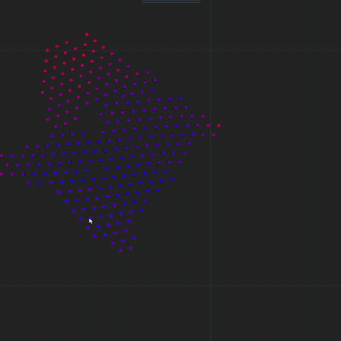

# Chemical Simulator

Симулятор химических взаимодействий в 2.5D на C++ с визуализацией через SFML и UI через ImGui.

## Что реализовано на данный момент

- Простой 2.5D-движок для визуализации на базе SFML
- Базовый интерфейс (ImGui)
- Интеграция движения методом Verlet
- Пространственная сетка для ускорения поиска соседей
- Формирование связей (H–H, H–O–H)
- Поддержка угловых взаимодействий для систем из 3 атомов



## Стек и зависимости

- C++20 (проект на CMake)
- SFML 3.0.2
- ImGui + ImGui-SFML
- MinGW-w64 (для Windows-сборки, GCC с поддержкой C++20)

## Для сборки проекта необходимо дополнительно установить:

- **MinGW-w64 (компилятор C++, GCC 14+ / C++20)**  
  https://github.com/brechtsanders/winlibs_mingw/releases/download/14.2.0posix-19.1.1-12.0.0-ucrt-r2/winlibs-x86_64-posix-seh-gcc-14.2.0-mingw-w64ucrt-12.0.0-r2.7z

- **CMake**  
  https://cmake.org/download/

## Сборка и запуск (Windows, MinGW)

```bash
cmake -S . -B build -G "MinGW Makefiles"
cmake --build build -j 8
```

После сборки исполняемый файл:
`Chemical-simulator.exe` в корне проекта.

## Архитектура

- `main.cpp`
Точка входа, настройка сцены, запуск цикла обновления/рендера.
- `Engine/Simulation.*`
Оркестратор симуляции: физика, события, связь между рендером и UI.
- `Engine/Renderer.*`
Отрисовка атомов/связей/сетки/эффектов.
- `Engine/physics/Atom.*`
Состояние атома, интегрирование, вычисление сил.
- `Engine/physics/Bond.*`
Связи между атомами и их динамика.
- `Engine/physics/SpatialGrid.*`
Пространственная сетка для ускорения поиска соседей.
- `Engine/Tools.*`
Утилиты ввода и выделения.
- `interface.*`
ИмGUI-интерфейс.

## Основные классы и методы

### `Simulation` (`Engine/Simulation.h`)

- `void update(float dt)`
Основной шаг симуляции: предсказание позиций, силы, связи, коррекция скоростей.
- `void renderShot(float dt)`
Вызов рендера кадра.
- `void event()`
Обработка событий UI.
- `void pollEvents()`
Обработка событий окна.
- `void setSizeBox(Vec3D newStart, Vec3D newEnd, int cellSize = -1)`
Изменение размеров симуляционного бокса.
- `Atom* createAtom(Vec3D start_coords, Vec3D start_speed, int type, bool fixed = false)`
Создание атома.
- `void addBond(Atom* a1, Atom* a2)`
Создание связи между атомами.
- `void createRandomAtoms(int type, int quantity)`
Генерация случайных атомов.
- `void drawGrid(bool flag = true)`
Включение/выключение отображения сетки.
- `void drawBonds(bool flag = true)`
Включение/выключение отображения связей.
- `void speedGradient(bool flag = true)`
Включение/выключение окраски атомов по скорости.
- `void setCameraPos(double x, double y)`
Перемещение камеры.
- `void setCameraZoom(float new_zoom)`
Масштаб камеры.

### `Renderer` (`Engine/Renderer.h`)

- `void drawShot(const std::vector<Atom>& atoms, const SimBox& box, float deltaTime)`
Полная отрисовка кадра.
- `void wallImage(const Vec3D start, const Vec3D end)`
Построение текстуры поля стенок.
- `void setSelectionFrame(Vec2D start, Vec2D end, float scale)`
Отрисовка прямоугольника выделения.

Публичные флаги рендера:

- `drawGrid`
- `drawBonds`
- `speedGradient`
- `speedGradientTurbo`

### `Atom` (`Engine/physics/Atom.h`)

- `void PredictPosition(double deltaTime)`
Шаг интегратора (Verlet-предсказание позиции).
- `void ComputeForces(SimBox& box, double deltaTime)`
Расчет сил (стенки + межатомные взаимодействия).
- `void CorrectVelosity(double dt)`
Коррекция скорости после расчета сил.
- `void SoftWalls(SimBox& box, double deltaTime)`
Мягкие стенки бокса.
- `Vec3D NonBondedForce(Atom* a1, Atom* a2, double dt)`
Невалентная сила.
- `float LennardJonesForce(float d)`
Сила Lennard-Jones.
- `float LennardJonesPotential(float d)`
Потенциал Lennard-Jones.

### `Bond` (`Engine/physics/Bond.h`)

- `static Bond* CreateBond(Atom* a, Atom* b)`
Создание связи.
- `static void BreakBond(Bond* bond)`
Разрыв связи.
- `void forceBond(double dt)`
Сила связи (Morse).
- `bool shouldBreak() const`
Проверка условия разрыва.
- `void detach()`
Отключение связи от атомов.
- `static void angleForce(Atom* a, Atom* b, Atom* c)`
Угловое взаимодействие для тройки атомов.

### `Tools` (`Engine/Tools.h`)

- `void init(...)`
Инициализация доступа к окну/камере/сцене.
- `void selectionFrame(...)`
Выделение атомов рамкой.
- `Vec2D screenToWorld(...)`
Преобразование экранных координат в мировые.
- `Vec2D screenToBox(...)`
Преобразование экранных координат в локальные координаты бокса.

## Управление и отладка

- Камера управляется через `Camera` (колесо/перемещение, см. `Engine/Camera.*`).
- В `main.cpp` можно включать/выключать режимы:
`simulation.drawBonds()`, `simulation.speedGradient(true)`, `simulation.render.speedGradientTurbo = true`.
- Для логов доступны методы:
`logAtomPos()`, `logMousePos()`, `logBondList()`.

## Ограничения текущей версии

- Не все элементы периодической таблицы имеют полноценные параметры.
- Часть API находится в активной разработке (например, расчёт средней энергии).
- Некоторые названия методов исторические и требуют рефакторинга (например, `CorrectVelosity`).

## Лицензии

Сторонние библиотеки загружаются в процессе сборки через FetchContent. Все они распространяются согласно их оригинальным лицензиям:
- [SFML](https://github.com/SFML/SFML)
- [ImGui](https://github.com/ocornut/imgui)
- [ImGui-SFML](https://github.com/SFML/imgui-sfml)
